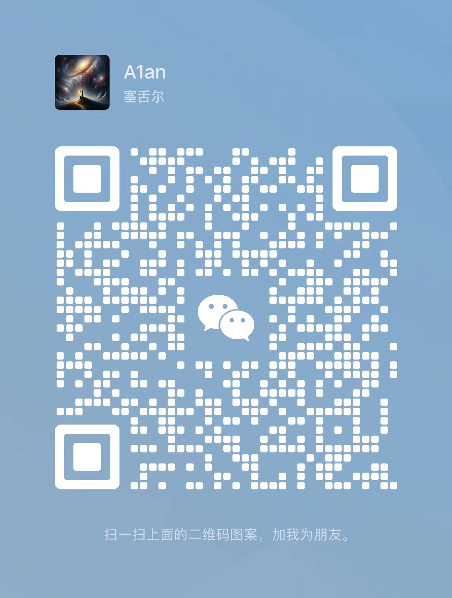

### Hi there! Nice to see you. 👋

***
Welcome to my GitHub page!

I'm A1an, a fullstack developer.

- 🔭 I’m currently working on data analyzing and reverse engineering.
- 👯 I’m looking to collaborate on blockchain and Web3 projects.
- 📫 How to reach me:
  
  

Tips: Before GitHub introduced the free private repository feature, I had moved some of my projects to my private Gitea
repository,
which resulted in the loss of some star and fork data. Additionally, the lack of proper maintenance for some projects
also led to losses. Despite this, I am not bothered by these past losses.

On May 1, 2023, I decided to move my projects back to GitHub, looking forward to showcasing them on this platform with a
fresh start.
***

### Skills Showcase (A Glimpse):

Here are some of the technologies I excel at. This is just a glimpse of my skill set, feel free to reach out for more
details.

**Primary Languages:**

**Primary Frameworks and Libraries:**

**Databases:**

### Industry Experience:

Throughout my vibrant technical journey, I've had the opportunity to be involved in projects across a myriad of domains,
garnering valuable hands-on experience.

Here's a succinct overview of my experiences:

1. **Software and System Development:**
   Engaged in a variety of project developments encompassing network transmission, external device integration, e-commerce
   platforms, financial website displays, and order management statistical systems.
2. **Blockchain Technology and Applications:**
   Encompasses the establishment and management of a Bitcoin mining farm, development of automated trading bots, and the
   design of market analysis systems for Bitcoin trading platforms.
3. **Augmented Reality/Virtual Reality/Mixed Reality (AR/VR/MR) and Game Development**:
   Realized 3D software content and AR/VR/MR applications development through the Unity engine.
4. **Mobile Application and Microservices Development:**
   Engaged in WeChat Mini Program platform and reverse engineering projects for certain APKs.
5. **Automation and Scripting Development:**
   Authored a series of automation scripts and tools for other routine operations.

***

### GitHub Stats:

***

### Wechat QR Code:

<!--
**A1anSong/A1anSong** is a ✨ _special_ ✨ repository because its `README.md` (this file) appears on your GitHub profile.

Here are some ideas to get you started:

- 🔭 I’m currently working on ...
- 🌱 I’m currently learning ...
- 👯 I’m looking to collaborate on ...
- 🤔 I’m looking for help with ...
- 💬 Ask me about ...
- 📫 How to reach me: ...
- 😄 Pronouns: ...
- ⚡ Fun fact: ...
-->
